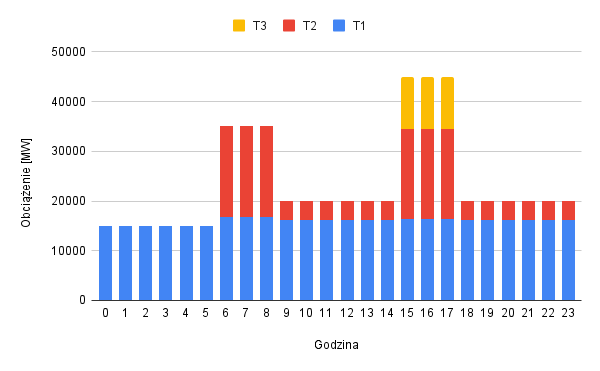
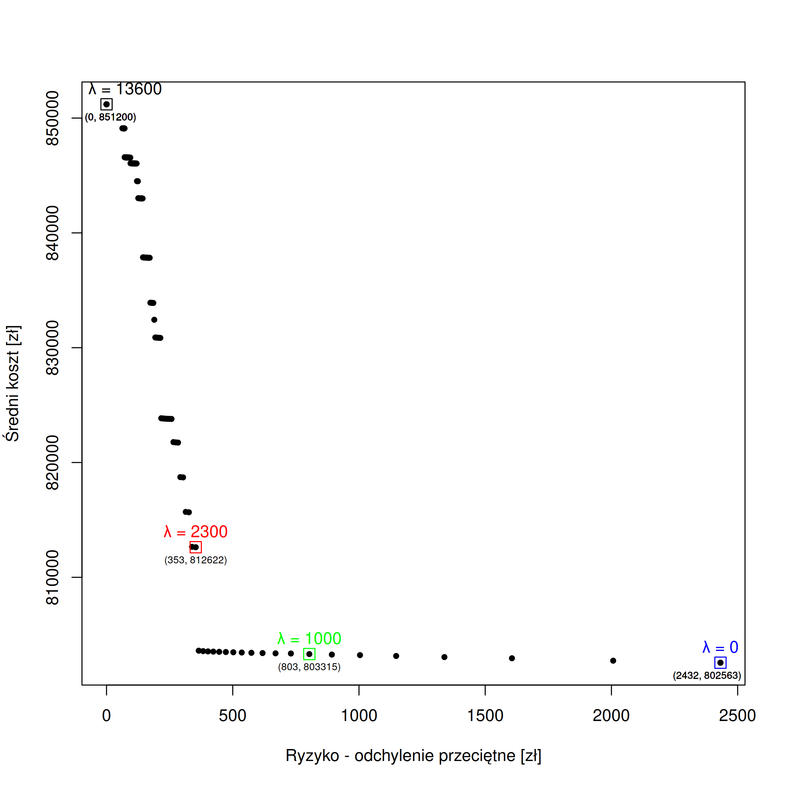
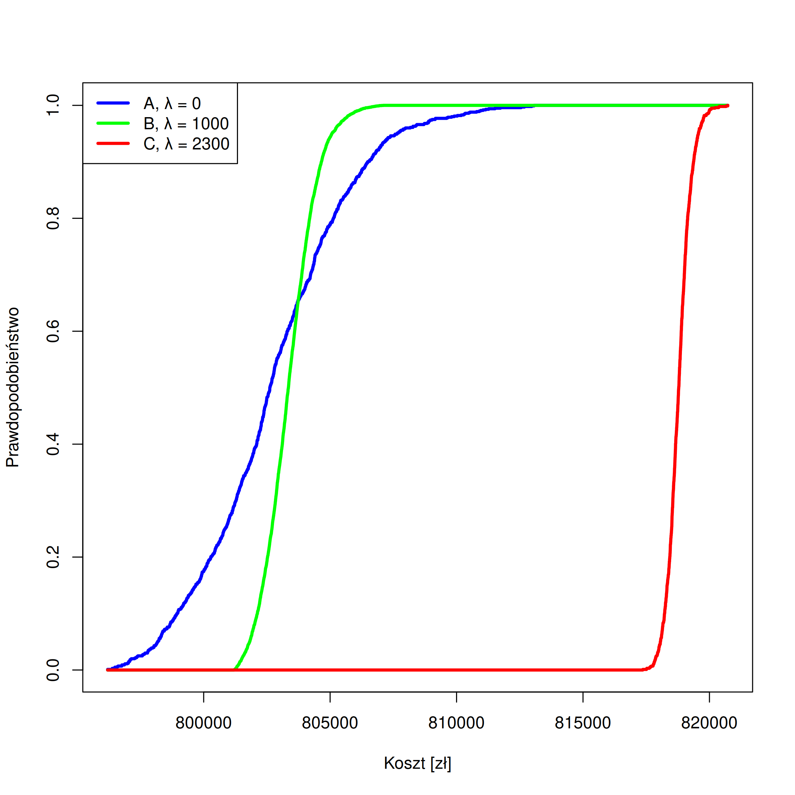

# WDWR - Projekt

Autor: Szymon Wysocki

## Zadanie 1

Zadanie 1 polegało na minimalizacji oczekiwanego kosztu całkowitego pracy elektrowni. Ponieważ koszt ten jest związany ze zmienną losową $\textbf{R}$ wyłącznie przez równania liniowe, skorzystałem z zależności $\mathbb{E}(Koszt(\textbf{R})) = Koszt(\mathbb{E}(\textbf{R}))$.

Rozkład $\textbf{R}$ jest znany, więc wartość $\mathbb{E}(\textbf{R})$ obliczyłem analitycznie przy pomocy wzoru dostarczonego w materiał pomocniczych do projektu (plik `generate_zad1_data.r`). Otrzymałem następujące wyniki:

$\mathbb{E}(\textbf{R}_1)=2.655467 \\
\mathbb{E}(\textbf{R}_2)=2.906804 \\
\mathbb{E}(\textbf{R}_3)=3.080570$

### Model analityczny

#### Przyjęte założenia

* Elektrownia działa w sposób ciągły, a więc po godzinie 23 następuje godzina 0. Koszt pierwotnego włączenia generatorów jest pomijany.
* Generator może znajdować się w jednym z trzech stanów:
    * 0MW - wyłączone
    * od obciążenia min. do 90% obciążenia max. - pracujące w normalnym zakresie
    * od 90% obciążenia max. do obciążenia max. - pracujące w przeciążeniu
* Generatory danego typu w danym stanie są nierozróżnialne, a rozkład obciążenia między nimi nieistotny. Ważna jest jedynie ich sumaryczne obciążenie. 

#### Zmienne
Dla wszystkich zmiennych $g\in [0..23]$ oraz $t\in\set{1, 2, 3}$
| Zmienna                              | Opis                                                                            |
|:------------------------------------ | ------------------------------------------------------------------------------- |
| $w_{gt} \in \mathbb{N}_0$            | Liczba generatorów typu $t$ pracujących (w przeciążeniu lub nie) o godzinie $g$ |
| $p_{gt} \in \mathbb{N}_0$            | Liczba generatorów typu $t$ pracujących w przeciążeniu o godzinie $g$           |
| $o_{gt} \in [0, \infty)$             | Łączne obciążenie generatorów typu $t$ o godzinie $g$ [MW]                      |
| $(\Delta w_{gt})_+ \in \mathbb{N}_0$ | Liczba generatorów typu $t$ uruchomiona o godzinie $g$                          |
| $(\Delta w_{gt})_- \in \mathbb{N}_0$ | Liczba generatorów typu $t$ wyłączona o godzinie $g$                            | 

#### Ograniczenia

Dolne ograniczenie obciążenia:

$\forall g \in [0..23]\quad o_{g1} \ge w_{g1} \cdot 1000 \\
\forall g \in [0..23]\quad o_{g2} \ge w_{g2} \cdot 1300 \\
\forall g \in [0..23]\quad o_{g3} \ge w_{g3} \cdot 1500$

Górne ograniczenie obciążenia:

$\forall g \in [0..23]\quad o_{g1} \le 2000 \cdot (0.9(w_{g1}-p_{g1}) + p_{g1}) \\
\forall g \in [0..23]\quad o_{g2} \le 1800 \cdot (0.9(w_{g2}-p_{g2}) + p_{g2}) \\
\forall g \in [0..23]\quad o_{g3} \le 3000 \cdot (0.9(w_{g3}-p_{g3}) + p_{g3})$

Zaspokojenie bazowego zapotrzebowania:

$\forall g \in [0..6)  \quad \sum_{t\in\set{1,2,3}}o_{gt} = 15000 \\
\forall g \in [6..9)  \quad \sum_{t\in\set{1,2,3}}o_{gt} = 35000 \\
\forall g \in [9..15) \quad \sum_{t\in\set{1,2,3}}o_{gt} = 20000 \\
\forall g \in [15..18)\quad \sum_{t\in\set{1,2,3}}o_{gt} = 45000 \\
\forall g \in [18..24)\quad \sum_{t\in\set{1,2,3}}o_{gt} = 20000$

Możliwość pokrycia wzrostu zapotrzebowania przez pracujące generatory:

$\forall g \in [0..6)   \quad 2000w_{g1} + 1800w_{g2} + 3000w_{g3} \ge 1.1 \cdot 15000 \\
\forall g \in [6..9)   \quad 2000w_{g1} + 1800w_{g2} + 3000w_{g3} \ge 1.1 \cdot 35000 \\
\forall g \in [9..15)  \quad 2000w_{g1} + 1800w_{g2} + 3000w_{g3} \ge 1.1 \cdot 20000 \\
\forall g \in [15..18) \quad 2000w_{g1} + 1800w_{g2} + 3000w_{g3} \ge 1.1 \cdot 45000 \\
\forall g \in [18..24) \quad 2000w_{g1} + 1800w_{g2} + 3000w_{g3} \ge 1.1 \cdot 20000$

Dostępność generatorów:

$\forall g \in [0..23]\quad w_{g1} \le 16 \\
\forall g \in [0..23]\quad w_{g2} \le 14 \\
\forall g \in [0..23]\quad w_{g3} \le 12 \\
\forall g \in [0..23]\; \forall t \in \set{1,2,3}\quad p_{gt} \le w_{gt}$

Uruchamianie i wyłączanie generatorów (założenie $g_{(-1),t} = g_{23,t}$):

$\forall g \in [0..23]\; \forall t \in \set{1,2,3}\quad w_{gt} = w_{(g-1),t} + (\Delta w_{gt})_+ - (\Delta w_{gt})_-$

#### Funkcja celu
$\min K$ , gdzie:

$K=K_1 + K_2 + K_3 + K_4$

Koszt uruchamiania generatorów:

$K_1=\sum_{g \in [0..23]} (2000(\Delta w_{g1})_+ + 1500(\Delta w_{g2})_+ + 1000(\Delta w_{g3})_+)$

Koszt pracy przy minimalnym obciążeniu:

$K_2=\sum_{g \in [0..23]} (1000w_{g1} + 2500w_{g2} + 3200w_{g3})$

Koszt pracy powyżej minimalnego obciążenia:

$K_3=\sum_{g \in [0..23]} (2.655467(o_{g1}-1000w_{g1}) + 2.906804(o_{g2}-1300w_{g2}) + 3.080570(o_{g3}-1500w_{g3}))$

Koszt pracy w przeciążeniu:

$K_4=\sum_{g \in [0..23]}\;\sum_{t \in \set{1,2,3}}\;200p_{gt}$

### Rozwiązanie i wnioski

Powyższy model zaimplementowałem w języku AMPL (pliki `zad1.mod`, `projekt.dat`, `zad1.dat`, `zad1.run`). Za pomocą solvera CPLEX uzyskałem rozwiązanie o koszcie **803649.6015&nbsp;zł**.

Poniżej przedstawiłem wykres rozkładu obciążenia $o_{gt}$ w ciągu doby: 

Większość obciążenia jest pokryta przez generatory T1. Jest to uzasadnione tym, że cechują się one najtańszą ceną zł/MW przy minimalnym obciążeniu. Wysoki koszt uruchomienia nie ma dużego znaczenia, bo działają one całą dobę bez przerwy. Dopiero gdy skończyły się dostępne generatory T1, uruchomione zostały T2 i T3.

Następnie przeanalizowałem liczbę pracujących i przeciążonych generatorów:

| Godzina | $w_{g1}$ | $w_{g2}$ | $w_{g3}$ | $p_{g1}$ | $p_{g2}$ | $p_{g3}$ |
| ------- | -------- | -------- | -------- | -------- | -------- | -------- |
| 0       | 15       | 0        | 0        | 0        | 0        | 0        |
| 1       | 15       | 0        | 0        | 0        | 0        | 0        |
| 2       | 15       | 0        | 0        | 0        | 0        | 0        |
| 3       | 15       | 0        | 0        | 0        | 0        | 0        |
| 4       | 15       | 0        | 0        | 0        | 0        | 0        |
| 5       | 15       | 0        | 0        | 0        | 0        | 0        |
| 6       | 16       | 14       | 0        | 0        | 0        | 0        |
| 7       | 16       | 14       | 0        | 0        | 0        | 0        |
| 8       | 16       | 14       | 0        | 0        | 0        | 0        |
| 9       | 16       | 3        | 0        | 0        | 0        | 0        |
| 10      | 16       | 3        | 0        | 0        | 0        | 0        |
| 11      | 16       | 3        | 0        | 0        | 0        | 0        |
| 12      | 16       | 3        | 0        | 0        | 0        | 0        |
| 13      | 16       | 3        | 0        | 0        | 0        | 0        |
| 14      | 16       | 3        | 0        | 0        | 0        | 0        |
| 15      | 16       | 14       | 7        | 0        | 0        | 0        |
| 16      | 16       | 14       | 7        | 0        | 0        | 0        |
| 17      | 16       | 14       | 7        | 0        | 0        | 0        |
| 18      | 16       | 3        | 0        | 0        | 0        | 0        |
| 19      | 16       | 3        | 0        | 0        | 0        | 0        |
| 20      | 16       | 3        | 0        | 0        | 0        | 0        |
| 21      | 16       | 3        | 0        | 0        | 0        | 0        |
| 22      | 16       | 3        | 0        | 0        | 0        | 0        |
| 23      | 16       | 3        | 0        | 0        | 0        | 0        |

Żaden z generatorów nie wszedł w stan przeciążenia. Jest to spowodowane tym, że uruchomienie dodatkowego generatora jest niemal zawsze tańsze niż dodanie obciążenia do generatora już pracującego. Przykładowo, w godzinach 15-17, uruchomienie i praca 7 generatorów T3 kosztowała 70200 zł; pokrycie tego samego obciążenia przez generatory T1 kosztowałoby 83645 zł. 

## Zadanie 2

W drugim zadaniu należało dodatkowo uwzględnić ryzyko rozwiązania zdefiniowane jako odchylenie przeciętne. Jest to zadanie dwukrytyrialne, dlatego do wyznaczenia rozwiązań efektywnych niezbędny był wybór funkcji skalaryzującej.

W pierwszym podejściu użyłem ważonej skalaryzacji minimaksowej:
$$\min\max\set{\lambda_1\cdot\mathbb{E}(\text{Koszt}), \lambda_2\cdot\text{Ryzyko}}$$
W przeciwieństwie do np. średniej ważonej, umożliwia ona uzyskanie wszystkich rozwiązań efektywnych. Wzór można dodatkowo uprościć (bez wpływu na zbiór rozwiązań), skalując wektor ocen przez stałą $\frac{1}{\lambda_1}$. Skalaryzacja ta jest jednak niemonotoniczna (uwzględnia tylko najwyższą z ocen), a więc może generować rozwiązania nieefektywne. Dlatego zastosowałem regularyzację funkcją sumy:

$$\text{lexmin}\set{\max\set{\mathbb{E}(\text{Koszt}), \lambda\cdot\text{Ryzyko}}, \mathbb{E}(\text{Koszt})+\text{Ryzyko}}$$

Jako ostatni krok, operator $\text{lexmin}$ przybliżyłem sumą z wagą $\epsilon$, aby powstałe zadanie optymalizacji było liniowe:

$$\text{min}\max\set{\mathbb{E}(\text{Koszt})\lambda\cdot\text{Ryzyko}} + \epsilon(\mathbb{E}(\text{Koszt})+\text{Ryzyko})$$

Aby obliczyć wartości ryzyka, wygenerowałem 50 potencjalnych scenariuszy (wartości zmiennej losowej $\textbf{R}$) (plik `generate_zad2_data.R`).

### Model analityczny

Niech $R_{ts}$ oznacza koszt za MW powyżej min. obc. dla generatora $t$ w scenariuszu $s$, gdzie $s \in [0..50)$

W porównaniu z modelem z zadania 1, wprowadziłem następujące zmiany:

1. zmieniłem sposób obliczania kosztu $K_3$:

    $K_{3s}=\sum_{g \in [0..23]} (R_{1s}(o_{g1}-1000w_{g1}) + R_{2s}(o_{g2}-1300w_{g2}) + R_{3s}(o_{g3}-1500w_{g3}))$

2. zmieniłem sposób obliczania kosztu całkowitego $K$:

    $K_s=K_1 + K_2 + K_{3s} + K_4$

3. wprowadziłem do modelu obliczanie miary ryzyka:

    $\mathbb{E}(K) = \sum_{s\in[0..50)}\frac{1}{50}K_s \\
\forall{s\in[0..50)}\quad(d_s)_+ \ge 0 \\
\forall{s\in[0..50)}\quad(d_s)_- \ge 0 \\
\forall{s\in[0..50)}\quad(d_s)_+ + (d_s)_- = \mathbb{E}(K)-K_s \\
\delta=\sum_{s\in[0..50)}\frac{1}{50}((d_s)_++(d_s)_-)$

4. zmieniłem funkcję celu:

    $S\ge\lambda\delta \\
S\ge\mathbb{E}(K) \\
\min S + \epsilon(\delta+\mathbb{E}(K))$

### Zbiór rozwiązań efektywnych

Przedstawiony wyżej model zaimplementowałem w plikach AMPL `zad2.mod`, `projekt.dat`, `zad2ab.dat`, `zad2ab.run`.

Następnie za pomocą solvera CPLEX znalazłem rozwiązania dla parametrów $\lambda$ ze zbioru $\set{0, 100, 200...15000}$. Wyniki przedstawiłem w przestrzeni ryzyko-koszt (plik `draw_cost_vs_risk.r`):

Kształt wykresu wskazuje, że wszystkie wygenerowane rozwiązania są efektywne -- żadne rozwiązanie nie dominuje innego. 

Widoczne grupy punktów wynikają z dyskretnej natury zadania; w szczególności grupa o średnim koszcie ok. 803000 zł odpowiada konfiguracji włączonych generatorów takiej, jak w zadaniu 1. Zmianie ulega jedynie rozkład obciążenia między typami generatorów.

Dla $\lambda=0$ (a więc przy braku awersji do ryzyka) osiągany jest minimalny koszt **802563 zł** przy odchyleniu przeciętnym **2432 zł**. Rozbieżność między kosztem uzyskanym w zadaniu 1 może wynikać z niewystarczającej liczby wygenerowanych próbek.

Dla $\lambda=13600$ i większych ryzyko zostaje zminimalizowane do zera, skutkując kosztem **851200 zł**. Jest to sytuacja, w której całe zapotrzebowanie jest pokryte przez generatory pracujące przy minimalnym obciążeniu.

### Analiza dominacji stochastycznej

Zastosowana miara ryzyka i skalaryzacja gwarantują, że wygenerowane rozwiązania są niezdominowane w sensie zwykłej dominacji, tj. dla rozw. $Y'$ nie istnieje inne rozwiązanie $Y''$, którego obie współrzędne są nie większe, a przynajmniej jedna ściśle mniejsza niż w $Y'$.

Wygenerowane rozwiązania mogą jednak być zdominowane w sensie dominacji stochastycznej pierwszego (lub wyższego) rzędu. W celu sprawdzenia występowania dominacji FSD można porównać wzajemne położenie dystrybuant.

Do analizy wykorzystałem następujące rozwiązania:
 * A$\:=(2432, 802563)$ dla $\lambda=0$
 * B$\:=(803, 803315)$ dla $\lambda=1000$
 * C$\:=(353, 812622)$ dla $\lambda=2300$
 
W celu zwiększenia rozdzielczości wykresu wygenerowałem 1000 scenariuszy (plik `generate_zad2c_data.r`). Następnie rozwiązałem model dla wybranych parametrów, zapisując do plików koszty dla poszczególnych scenariuszy (plik `zad2c.run`). Skryptem `draw_cdf.r` wyznaczyłem i zaznaczyłem na wykresie dystrybuanty kosztu:

Aby zmienna losowa $Y'$ dominowała w sensie FSD $Y''$, muszą zajść dwa warunki:
 1. $\forall k\quad F_{Y'}(k) \ge F_{Y''}(k)$
 2. $\exists k\quad F_{Y'}(k) \gt F_{Y''}(k)$

A więc:
* $A \succ_{FSD} C$ - np. dla $k=810000$ dystrybuanta A jest ściśle większa, dla pozostałych $k$ nie mniejsza
* $B \succ_{FSD} C$ - jak wyżej
* $A$ jest nieporównywalne z $B$ w sensie FSD - wykresy dystrybuant się przecinają, więc nie jest spełniony warunek 1.